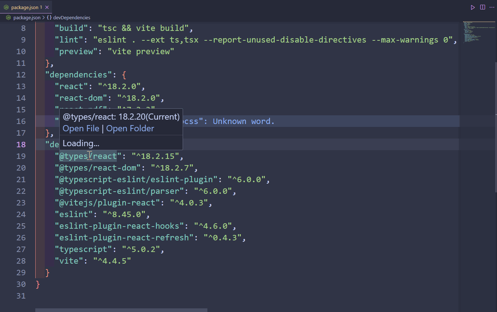

# npm-tools

对`npm`的功能增强，增加了对`package.json`依赖包查看的功能

## 功能

- 在`package.json`中查看已安装依赖包的版本
- 支持一键跳转到依赖包的入口文件(`Ctrl + 鼠标左键`)
- 支持一键新窗口打开依赖包项目目录

## 插件配置

待补充

## 已知问题

暂无

## 版本更新

### 0.0.1

1. 增加当前安装依赖包的版本展示，支持一键打开包入口文件.

---

**Enjoy!**
